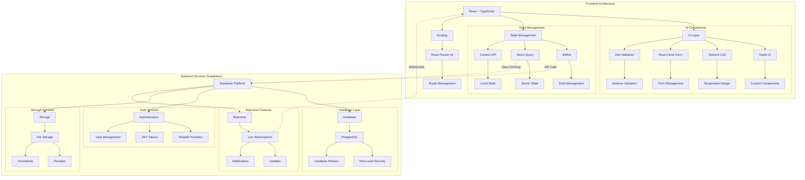
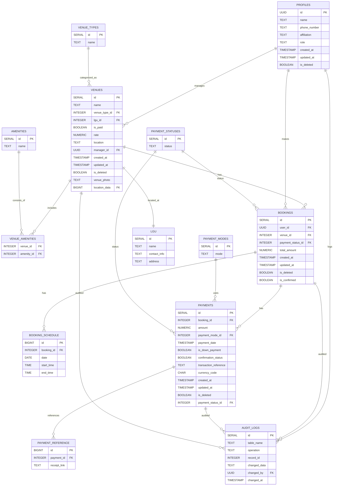
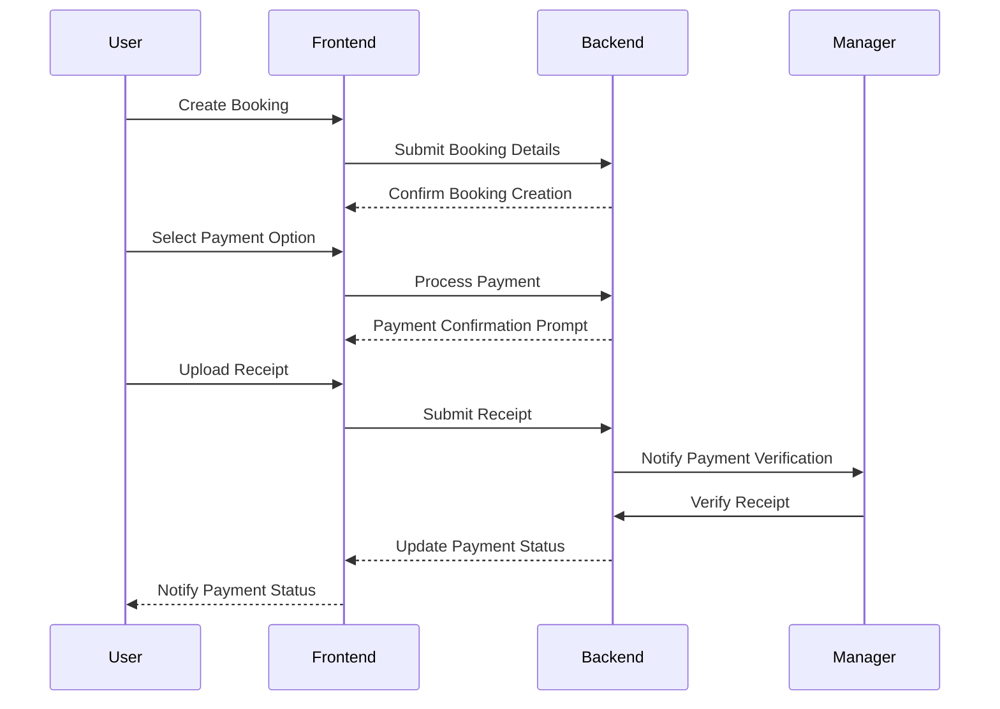
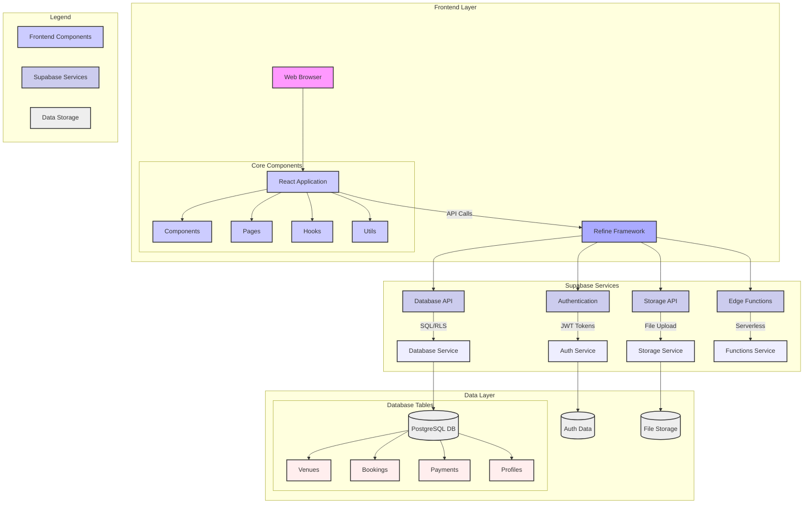
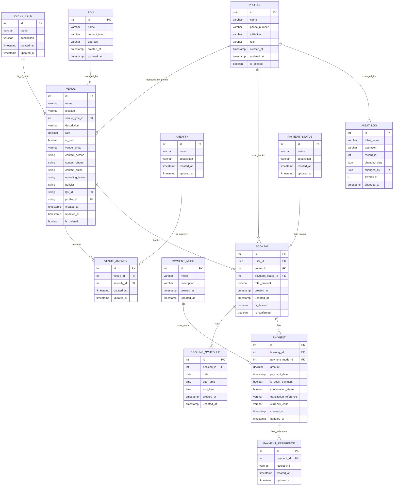
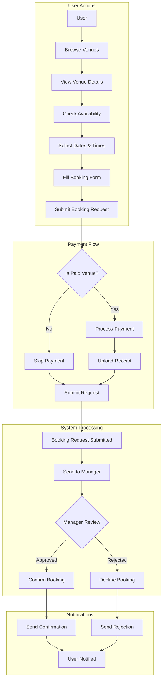
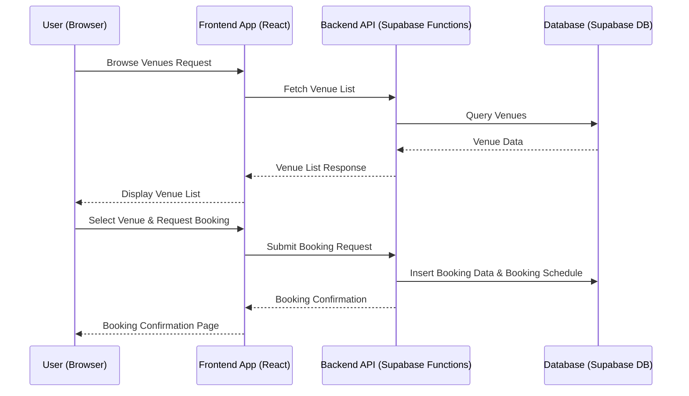
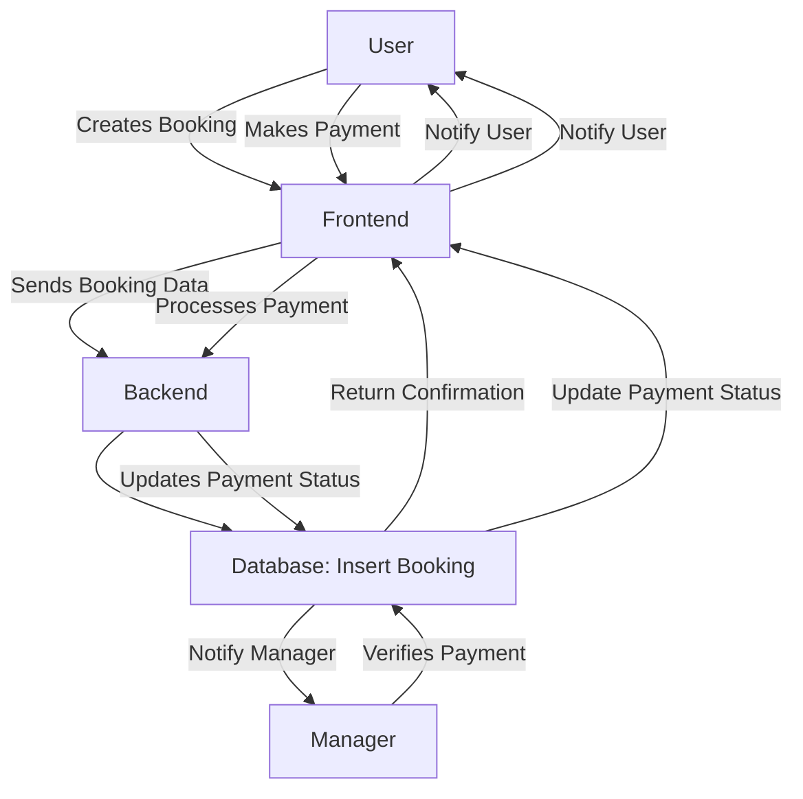
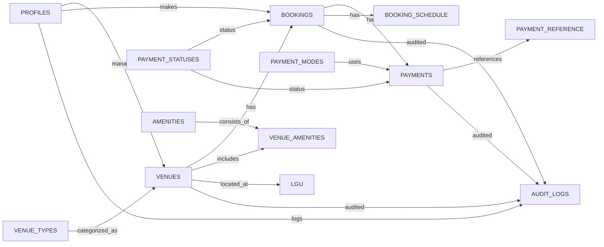
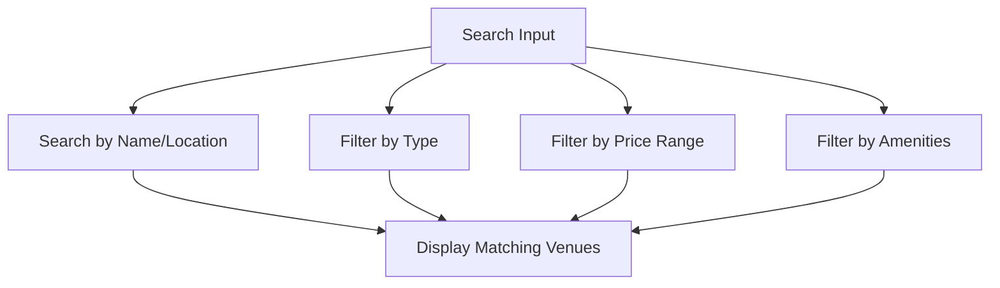

# JHCSC Venue Booking System

## Features

### Venue Management

- **Comprehensive Venue Listings**

  - Detailed venue information including name, location, and type
  - Amenity tracking and management
  - Venue rate configuration (free/paid)
  - Real-time availability status

- **Search and Filtering**
  - Search by venue name and location
  - Filter by venue type and price range
  - Sort venues by various criteria
  - Advanced filtering options for amenities

### Booking System

- **Flexible Scheduling**

  - Multi-day booking support
  - Customizable time slots
  - Real-time availability checking
  - Conflict prevention

- **Payment Processing**

  - Multiple payment modes support
  - Flexible payment options:
    - Full payment
    - Down payment (50% or 75%)
    - Custom amount within range
  - Receipt upload and verification
  - Payment status tracking
  - Currency handling (PHP)
  - Transaction reference management

- **Booking Management**
  - Detailed booking summaries
  - Status tracking (Pending, Approved, Declined)
  - Booking history
  - Cancellation handling

### User Management

- **Role-based Access Control**

  - **Admin**: Full system management
  - **Manager**: Venue and booking management
  - **User**: Booking and profile management

- **User Profiles**
  - Contact information management
  - Booking history tracking
  - Affiliation details
  - Profile customization

### Real-time Features

- **Live Updates**
  - Instant booking status changes
  - Real-time venue availability
  - Payment status updates
  - Notification system for:
    - Booking confirmations
    - Payment verifications
    - Status changes
    - Cancellations

## Tech Stack



### Frontend

- **Framework**: React with TypeScript
- **UI Components**:
  - Custom components built with [Radix UI](https://www.radix-ui.com)
  - Responsive design with [Tailwind CSS](https://tailwindcss.com)
  - Form handling with [React Hook Form](https://react-hook-form.com)
  - Validation with [Zod](https://zod.dev)
- **State Management**:
  - [Refine](https://refine.dev) for data management
  - [React Query](https://react-query.tanstack.com) for server state
  - Context API for local state
- **Routing**: [React Router v6](https://reactrouter.com/)

### Backend (Supabase)

- **Database**: PostgreSQL with Row-Level Security (RLS) policies
- **Authentication**: Built-in auth with multiple providers
- **Storage**: File storage for receipts and documents
- **Real-time**: Live subscriptions for updates

## Project Structure

```bash
├── package.json
├── pnpm-lock.yaml
├── postcss.config.js
├── public
│   ├── favicon.ico
│   ├── fonts
│   │   └── geist
│   │       ├── Geist-Black.woff
│   │       ├── Geist-Bold.woff
│   │       ├── Geist-ExtraBold.woff
│   │       ├── Geist-ExtraLight.woff
│   │       ├── Geist-Light.woff
│   │       ├── Geist-Medium.woff
│   │       ├── Geist-Regular.woff
│   │       ├── Geist-SemiBold.woff
│   │       └── Geist-Thin.woff
│   └── jhcsc.ico
├── README.md
├── src
│   ├── app
│   │   └── dashboard
│   │       └── page.tsx
│   ├── App.css
│   ├── App.tsx
│   ├── authProvider.ts
│   ├── components
│   │   ├── app-sidebar.tsx
│   │   ├── blocks
│   │   ├── breadcrumb
│   │   │   └── index.tsx
│   │   ├── json-view.tsx
│   │   ├── layout
│   │   │   ├── booking.tsx
│   │   │   └── index.tsx
│   │   ├── LogsTable.tsx
│   │   ├── menu
│   │   │   └── index.tsx
│   │   ├── nav-main.tsx
│   │   ├── nav-secondary.tsx
│   │   ├── nav-user.tsx
│   │   ├── pages
│   │   │   └── auth
│   │   │       ├── components
│   │   │       │   ├── forgotPassword.tsx
│   │   │       │   ├── index.ts
│   │   │       │   ├── login.tsx
│   │   │       │   ├── register.tsx
│   │   │       │   └── updatePassword.tsx
│   │   │       └── index.tsx
│   │   ├── ui
│   │   │   ├── avatar.tsx
│   │   │   ├── badge.tsx
│   │   │   ├── breadcrumb.tsx
│   │   │   ├── button.tsx
│   │   │   ├── calendar.tsx
│   │   │   ├── card.tsx
│   │   │   ├── carousel.tsx
│   │   │   ├── checkbox.tsx
│   │   │   ├── collapsible.tsx
│   │   │   ├── dialog.tsx
│   │   │   ├── dropdown-menu.tsx
│   │   │   ├── file-upload.tsx
│   │   │   ├── form.tsx
│   │   │   ├── index.ts
│   │   │   ├── input.tsx
│   │   │   ├── label.tsx
│   │   │   ├── popover.tsx
│   │   │   ├── scroll-area.tsx
│   │   │   ├── select.tsx
│   │   │   ├── separator.tsx
│   │   │   ├── sheet.tsx
│   │   │   ├── sidebar.tsx
│   │   │   ├── skeleton.tsx
│   │   │   ├── sonner.tsx
│   │   │   ├── switch.tsx
│   │   │   ├── table.tsx
│   │   │   ├── tabs.tsx
│   │   │   └── tooltip.tsx
│   │   └── UpdatesTable.tsx
│   ├── globals.d.ts
│   ├── hooks
│   │   ├── use-click-outside.tsx
│   │   └── use-mobile.tsx
│   ├── index.tsx
│   ├── lib
│   │   └── utils.ts
│   ├── pages
│   │   ├── profiles
│   │   │   ├── create.tsx
│   │   │   ├── edit.tsx
│   │   │   ├── index.ts
│   │   │   ├── list.tsx
│   │   │   └── show.tsx
│   │   └── users
│   │       ├── approved
│   │       │   ├── index.ts
│   │       │   └── list.tsx
│   │       ├── book
│   │       │   ├── index.tsx
│   │       │   └── receipt-upload.tsx
│   │       ├── declined
│   │       │   ├── index.ts
│   │       │   └── list.tsx
│   │       ├── logs
│   │       │   └── index.tsx
│   │       ├── payment
│   │       │   └── index.tsx
│   │       ├── profiles
│   │       │   ├── index.ts
│   │       │   └── show.tsx
│   │       ├── updates
│   │       │   └── index.tsx
│   │       ├── venues
│   │       │   ├── components
│   │       │   │   ├── columns.tsx
│   │       │   │   └── venue-card.tsx
│   │       │   ├── hooks
│   │       │   │   └── useVenueFilter.ts
│   │       │   ├── index.ts
│   │       │   ├── list.tsx
│   │       │   ├── page.tsx
│   │       │   └── utils
│   │       │       ├── venue-query.ts
│   │       │       └── venue-query.types.ts
│   │       └── vw_bookers
│   │           ├── index.ts
│   │           ├── list.tsx
│   │           └── show.tsx
│   ├── types
│   │   ├── database.types.ts
│   │   ├── dev.types.ts
│   │   ├── logs.ts
│   │   └── updates.ts
│   ├── utility
│   │   ├── index.ts
│   │   └── supabaseClient.ts
│   ├── utils
│   │   └── debounce.ts
│   └── vite-env.d.ts
├── tailwind.config.js
├── tsconfig.json
├── tsconfig.node.json
├── vercel.json
└── vite.config.ts
```

## Database Schema

### Entity-Relationship Diagram



### Tables

Below are the core tables with their respective columns, data types, and descriptions.

#### Core Tables

| Table Name | Column Name     | Data Type       | Description                                         |
| ---------- | --------------- | --------------- | --------------------------------------------------- |
| `venues`   | `id`            | `serial`        | Primary key                                         |
|            | `name`          | `text`          | Name of the venue                                   |
|            | `venue_type_id` | `integer`       | Foreign key referencing `venue_types(id)`           |
|            | `lgu_id`        | `integer`       | Foreign key referencing `lgu(id)`, nullable         |
|            | `is_paid`       | `boolean`       | Indicates if the venue is paid                      |
|            | `rate`          | `numeric(10,2)` | Rate of the venue (required if `is_paid` is `true`) |
|            | `location`      | `text`          | Location address                                    |
|            | `manager_id`    | `uuid`          | Foreign key referencing `profiles(id)`              |
|            | `created_at`    | `timestamp`     | Timestamp of creation                               |
|            | `updated_at`    | `timestamp`     | Timestamp of last update                            |
|            | `is_deleted`    | `boolean`       | Soft delete flag                                    |
|            | `venue_photo`   | `text`          | URL or path to the venue photo                      |
|            | `location_data` | `bigint`        | Foreign key referencing `venue_location(id)`        |

| Table Name          | Column Name             | Data Type       | Description                                      |
| ------------------- | ----------------------- | --------------- | ------------------------------------------------ |
| `amenities`         | `id`                    | `serial`        | Primary key                                      |
|                     | `name`                  | `text`          | Name of the amenity (unique)                     |
| `venue_amenities`   | `venue_id`              | `integer`       | Foreign key referencing `venues(id)`             |
|                     | `amenity_id`            | `integer`       | Foreign key referencing `amenities(id)`          |
| `lgu`               | `id`                    | `serial`        | Primary key                                      |
|                     | `name`                  | `text`          | Name of the LGU (unique)                         |
|                     | `contact_info`          | `text`          | Contact information                              |
|                     | `address`               | `text`          | Address of the LGU                               |
| `payment_modes`     | `id`                    | `serial`        | Primary key                                      |
|                     | `mode`                  | `text`          | Payment mode (unique)                            |
| `payment_statuses`  | `id`                    | `serial`        | Primary key                                      |
|                     | `status`                | `text`          | Payment status (unique)                          |
| `profiles`          | `id`                    | `uuid`          | Primary key, references authentication user      |
|                     | `name`                  | `text`          | User's name                                      |
|                     | `phone_number`          | `text`          | User's phone number                              |
|                     | `affiliation`           | `text`          | User's affiliation                               |
|                     | `role`                  | `text`          | User's role (`admin`, `manager`, `user`)         |
|                     | `created_at`            | `timestamp`     | Timestamp of creation                            |
|                     | `updated_at`            | `timestamp`     | Timestamp of last update                         |
|                     | `is_deleted`            | `boolean`       | Soft delete flag                                 |
| `bookings`          | `id`                    | `serial`        | Primary key                                      |
|                     | `user_id`               | `uuid`          | Foreign key referencing `profiles(id)`           |
|                     | `venue_id`              | `integer`       | Foreign key referencing `venues(id)`             |
|                     | `payment_status_id`     | `integer`       | Foreign key referencing `payment_statuses(id)`   |
|                     | `total_amount`          | `numeric(10,2)` | Total booking amount                             |
|                     | `created_at`            | `timestamp`     | Timestamp of creation                            |
|                     | `updated_at`            | `timestamp`     | Timestamp of last update                         |
|                     | `is_deleted`            | `boolean`       | Soft delete flag                                 |
|                     | `is_confirmed`          | `boolean`       | Confirmation status                              |
| `booking_schedule`  | `id`                    | `bigint`        | Primary key                                      |
|                     | `booking_id`            | `integer`       | Foreign key referencing `bookings(id)`           |
|                     | `date`                  | `date`          | Booking date                                     |
|                     | `start_time`            | `time`          | Start time of booking                            |
|                     | `end_time`              | `time`          | End time of booking                              |
| `payments`          | `id`                    | `serial`        | Primary key                                      |
|                     | `booking_id`            | `integer`       | Foreign key referencing `bookings(id)`           |
|                     | `amount`                | `numeric(10,2)` | Payment amount                                   |
|                     | `payment_mode_id`       | `integer`       | Foreign key referencing `payment_modes(id)`      |
|                     | `payment_date`          | `timestamp`     | Date and time of payment                         |
|                     | `is_down_payment`       | `boolean`       | Indicates if it's a down payment                 |
|                     | `confirmation_status`   | `boolean`       | Payment confirmation status                      |
|                     | `transaction_reference` | `text`          | Unique transaction reference                     |
|                     | `currency_code`         | `char(3)`       | Currency code (default `USD`)                    |
|                     | `created_at`            | `timestamp`     | Timestamp of creation                            |
|                     | `updated_at`            | `timestamp`     | Timestamp of last update                         |
|                     | `is_deleted`            | `boolean`       | Soft delete flag                                 |
|                     | `payment_status_id`     | `integer`       | Foreign key referencing `payment_statuses(id)`   |
| `payment_reference` | `id`                    | `bigint`        | Primary key                                      |
|                     | `payment_id`            | `integer`       | Foreign key referencing `payments(id)`           |
|                     | `receipt_link`          | `text`          | Link to the payment receipt                      |
| `audit_logs`        | `id`                    | `serial`        | Primary key                                      |
|                     | `table_name`            | `text`          | Name of the table where the operation occurred   |
|                     | `operation`             | `text`          | Type of operation (`INSERT`, `UPDATE`, `DELETE`) |
|                     | `record_id`             | `integer`       | ID of the record affected                        |
|                     | `changed_data`          | `text`          | JSON representation of the changed data          |
|                     | `changed_by`            | `uuid`          | Foreign key referencing `profiles(id)`           |
|                     | `changed_at`            | `timestamp`     | Timestamp when the change occurred               |

### Supporting Tables

| Table Name         | Column Name    | Data Type | Description                     |
| ------------------ | -------------- | --------- | ------------------------------- |
| `venue_types`      | `id`           | `serial`  | Primary key                     |
|                    | `name`         | `text`    | Name of the venue type (unique) |
| `payment_modes`    | `id`           | `serial`  | Primary key                     |
|                    | `mode`         | `text`    | Payment mode (unique)           |
| `payment_statuses` | `id`           | `serial`  | Primary key                     |
|                    | `status`       | `text`    | Payment status (unique)         |
| `lgu`              | `id`           | `serial`  | Primary key                     |
|                    | `name`         | `text`    | Name of the LGU (unique)        |
|                    | `contact_info` | `text`    | Contact information             |
|                    | `address`      | `text`    | Address of the LGU              |

### Triggers and Functions

Triggers and functions ensure data integrity and audit logging.

- **Audit Logging**: Automatically logs changes to critical tables (`bookings`, `payments`, `profiles`, `venues`).
- **Payment Consistency Check**: Prevents overpayments by ensuring total payments do not exceed the booking amount.
- **Overbooking Prevention**: Prevents booking conflicts by ensuring no overlapping bookings for the same venue.
- **Update Timestamps**: Automatically updates the `updated_at` column on record updates.
- **Manager Role Validation**: Ensures only users with `admin` or `manager` roles can be assigned as venue managers.

_(For full SQL definitions, refer to the [Database Schema Section](#database-schema).)_

## Authentication

The system uses **Supabase Authentication** with the following features:

- **Authentication Methods**:

  - Email/Password authentication
  - Password recovery via email

- **Session Management**:

  - Secure session handling with JWT tokens
  - Session expiration and refresh mechanisms

- **Role-based Access Control (RBAC)**:
  - **Admin**: Full system access including user management, system configuration, and analytics.
  - **Manager**: Venue management, booking approval, payment verification, and schedule management.
  - **User**: Venue browsing, booking creation, profile management, and payment submission.

### User Roles

| Role    | Permissions                                                                                     |
| ------- | ----------------------------------------------------------------------------------------------- |
| Admin   | Full access to all system functionalities, including user management and system configurations. |
| Manager | Manage venues, approve bookings, verify payments, and handle scheduling.                        |
| User    | Browse venues, create bookings, manage their profiles, and submit payments.                     |

## Payment System

### Payment Processing

- **Supported Payment Modes**:

  - Credit/Debit Cards
  - Bank Transfers
  - E-wallets
  - and more...

- **Payment Options**:

  - **Full Payment**: Pay the entire booking amount upfront.
  - **Down Payment**: Pay a partial amount (e.g., 50% or 75%) with the remainder due later.
  - **Custom Amount**: Pay any amount within the allowed range.

- **Features**:
  - **Receipt Upload**: Users can upload payment receipts for verification.
  - **Payment Status Tracking**: Real-time tracking of payment statuses (`Pending`, `Verified`, `Declined`).
  - **Currency Handling**: Supports Philippine Peso (PHP) by default.
  - **Transaction References**: Unique identifiers for each transaction to prevent duplication and ensure traceability.

### Payment Workflow



## UI Components

Built with a custom component library featuring:

### Form Controls

- **Input Fields**: Text, number, email, and password fields with validation.
- **Select Menus**: Dropdowns with search functionality.
- **File Uploads**: Receipt uploads with preview capabilities.
- **Date and Time Pickers**: User-friendly selectors for dates and times.

### Navigation

- **Responsive Sidebar**: Collapsible navigation sidebar for easy access to different sections.
- **Tabbed Interfaces**: Organized content using tabs.
- **Breadcrumb Navigation**: Hierarchical navigation to indicate user location within the app.
- **Action Menus**: Contextual menus for performing actions on specific items.

### Data Display

- **Dynamic Tables**: Interactive tables with sorting, filtering, and pagination.
- **Card Layouts**: Visually appealing cards for displaying venue details and booking summaries.
- **List Views**: Organized lists for items like bookings and payments.
- **Status Indicators**: Visual cues (e.g., colors, icons) to represent statuses like confirmed, pending, or declined.

### Feedback

- **Toast Notifications**: Non-intrusive alerts for successful operations or errors.
- **Loading States**: Indicators to show data fetching or processing.
- **Error Messages**: Clear messages guiding users to resolve issues.
- **Success Indicators**: Visual confirmations for completed actions.

## Development

### Code Style

- **Linting**: [ESLint](https://eslint.org/) for code linting to ensure code quality and consistency.
- **Formatting**: [Prettier](https://prettier.io/) and [Biome](https://biome.build/) for automatic code formatting.
- **Type Safety**: [TypeScript](https://www.typescriptlang.org/) for robust type-checking.
- **Commit Linting**: Ensures commit messages follow the project's guidelines.

### Available Scripts

| Command              | Description                          |
| -------------------- | ------------------------------------ |
| `npm run dev`        | Start the development server         |
| `npm run build`      | Build the application for production |
| `npm run preview`    | Preview the production build         |
| `npm run lint`       | Run ESLint for code linting          |
| `npm run format`     | Format code with Prettier and Biome  |
| `npm run test`       | Run test suites                      |
| `npm run test:watch` | Run tests in watch mode              |

### Environment Variables

Configure environment variables by copying the example file and updating it with your Supabase credentials.

```bash
cp .env.example .env.local
```

Update `.env.local` with the following variables:

```env
VITE_SUPABASE_URL=your-supabase-url
VITE_SUPABASE_ANON_KEY=your-supabase-anon-key
```

## Responsive Design

The application is fully responsive with:

- **Mobile-first Approach**: Optimized for mobile devices first, then scales up to larger screens.
- **Adaptive Layouts**: Flexible layouts that adjust to different screen sizes and orientations.
- **Touch-friendly Interfaces**: Ensures usability on touch devices with appropriately sized buttons and controls.
- **Responsive Navigation Patterns**: Navigation adapts seamlessly across devices, maintaining accessibility and ease of use.

## 1. System Overview

The Venue Booking System is designed to streamline the process of booking venues for various events. It provides a user-friendly interface for browsing available venues, checking their details, submitting booking requests, and managing payments. The system is built using a modern web architecture, leveraging React for the frontend and Supabase for the backend services.

## 2. System Architecture

The system follows a three-tier architecture:

- **Presentation Tier (Frontend):** Built with React and Refine framework. This layer is responsible for user interaction, displaying data, and handling user requests.
- **Application Tier (Backend):** Implemented using Supabase services, including Supabase Functions (or Edge Functions - implied) for custom backend logic and API endpoints. This layer handles business logic, data processing, and communication with the database. While not explicitly in the provided code, we infer its presence and functionality.
- **Data Tier (Database):** Utilizes Supabase Database (PostgreSQL). This layer stores all system data, including venue information, user details, booking records, payment information, and audit logs.

### 2.1. Architecture Diagram



**Diagram Description:**

- **Presentation Tier:** Users interact with the system through a web browser, which loads the React application. The Refine framework within the React application handles data fetching, routing, and UI components.
- **Application Tier:** Refine communicates with Supabase services.
  - **Supabase Auth:** Manages user authentication and authorization.
  - **Supabase Database:** Provides the PostgreSQL database for storing structured data.
  - **Supabase Storage:** Stores files, such as payment receipts.
  - **Supabase Functions/Edge Functions (Implied):** While not explicitly in the provided frontend code, backend logic for complex operations, payment processing, or notifications would likely be implemented here.
- **Data Tier:** Supabase's PostgreSQL database and object storage form the data persistence layer.

## 3. Entity Relationship Diagram (ERD)

This ERD represents the database schema for the Venue Booking System, inferred from the code and typical venue booking system requirements.



**Table Descriptions:**

- **VENUE:** Stores information about each venue, including name, location, type, rate, photos, and manager details.
- **VENUE_TYPE:** Categorizes venues (e.g., "Hall", "Conference Room", "Sports Arena").
- **LGU (Local Government Unit):** Represents the local government unit associated with a venue (optional, for location-based filtering or management).
- **PROFILE:** Stores user profiles, including venue managers and regular users. Uses UUID for unique identification.
- **BOOKING:** Records booking requests, linking users to venues and storing booking status, total amount, and timestamps.
- **BOOKING_SCHEDULE:** Defines the specific dates and times for each booking, allowing for multi-day or recurring bookings.
- **PAYMENT:** Stores payment information related to bookings, including amount, payment mode, date, and status.
- **PAYMENT_MODE:** Lists available payment methods (e.g., "Credit Card", "Bank Transfer", "Cash").
- **PAYMENT_REFERENCE:** Stores links or references to payment receipts or transaction details (e.g., for file uploads).
- **AMENITY:** Lists venue amenities (e.g., "WiFi", "Parking", "Projector").
- **VENUE_AMENITY:** Many-to-many relationship table linking venues and their amenities.
- **AUDIT_LOG:** Tracks changes made to the database, recording operations, changed data, and timestamps for auditing purposes.
- **PAYMENT_STATUS:** Defines the status of payments (e.g., "Pending", "Paid", "Refunded").

## 4. User Flow Diagram - Booking a Venue

This diagram illustrates the typical user flow for booking a venue within the system.



**Flow Description:**

1.  **Browse Venues:** User navigates through the list of available venues.
2.  **View Venue Details:** User selects a venue to view detailed information, including photos, amenities, and rates.
3.  **Check Availability:** User checks the venue's calendar or availability for desired dates.
4.  **Select Dates & Times:** User chooses specific dates and times for their booking.
5.  **Fill Booking Form:** User fills out a booking form with event details and contact information.
6.  **Submit Booking Request:** User submits the booking request.
7.  **Payment (if Paid Venue):** If the venue is paid, the user is redirected to a payment gateway or payment section to complete the payment.
8.  **Booking Request Submitted:** User receives confirmation that their booking request has been submitted.
9.  **Confirmation Page:** User is shown a summary of their booking request.
10. **Manager Review & Approval (Backend):** (Backend process) Venue manager receives a notification and reviews the booking request.
11. **Booking Confirmed/Rejected:** (Backend process) Manager approves or rejects the booking request.
12. **User Notification:** User receives a notification (email, in-app) about the booking status (confirmed or rejected).

## 5. Sequence Diagram - Booking a Venue (Simplified)

This sequence diagram illustrates the technical interactions involved in a simplified venue booking process, focusing on the frontend and backend communication.



**Diagram Description:**

1.  **Browse Venues Request:** User initiates browsing venues from the frontend.
2.  **Fetch Venue List:** Frontend app requests the list of venues from the backend API.
3.  **Query Venues:** Backend API queries the database for venue data.
4.  **Venue Data:** Database returns venue data to the backend API.
5.  **Venue List Response:** Backend API sends the venue list response back to the frontend.
6.  **Display Venue List:** Frontend app displays the list of venues to the user.
7.  **Select Venue & Request Booking:** User selects a venue and submits a booking request.
8.  **Submit Booking Request:** Frontend app sends the booking request data to the backend API.
9.  **Insert Booking Data & Booking Schedule:** Backend API inserts the booking data and associated booking schedule into the database.
10. **Booking Confirmation:** Backend API sends a booking confirmation back to the frontend.
11. **Booking Confirmation Page:** Frontend app displays the booking confirmation page to the user.

## 6. How It Works

The Venue Booking System operates through the following key processes:

1.  **Venue Browsing:** Users can browse a list of venues, filter them by type, price, and search by name or location. Venue cards display essential information and photos.
2.  **Venue Details:** Clicking on a venue card leads to a detailed venue page with comprehensive information, including amenities, location, manager details, and booking options.
3.  **Booking Request:** Users can initiate a booking request by selecting dates and times, filling out a booking form, and optionally making a payment (if required for the venue).
4.  **Payment Processing:** For paid venues, the system handles payment collection, potentially integrating with payment gateways. Users can upload proof of payment.
5.  **Booking Management:** Users can view their booking history, check booking statuses (pending, approved, declined), and potentially cancel bookings (depending on system rules).
6.  **Manager Approval:** Venue managers (or administrators) review booking requests and approve or decline them.
7.  **Notifications:** Users and managers receive notifications about booking status changes, new booking requests, and other relevant events.
8.  **Authentication and Authorization:** User authentication is handled by Supabase Auth, ensuring secure access to the system and protecting user data. Authorization controls access to different features based on user roles (user, manager, admin).

## 7. System Process - Detailed Booking Process

1.  **User Browses Venues:**

    - User accesses the Venue Listing page (`/venues/list`).
    - Frontend application fetches venue data from the backend API (Supabase Database via Refine `useList` hook).
    - Venues are displayed as cards, allowing filtering and sorting.

2.  **User Selects a Venue and Initiates Booking:**

    - User clicks on a "Book Venue" button on a venue card or detail page.
    - User is navigated to the booking page (`/book/venue/:id`), where `:id` is the venue ID.

3.  **Booking Form Completion (`src/pages/users/book/index.tsx`):**

    - Booking page fetches venue details using `useOne` hook to display venue information.
    - User fills out the booking form, specifying:
      - Booking Dates and Times (using `react-hook-form` and Zod for validation).
      - Payment details (if the venue is paid), including amount, payment mode, and receipt upload.
    - Form validation is performed using Zod schema (`bookFormSchema`).
    - Total amount is dynamically calculated based on venue rate and selected booking hours.

4.  **Form Submission and Booking Creation:**

    - User submits the booking form.
    - `handleSubmit` function is triggered.
    - `handleConfirm` function is called after user confirmation dialog.
    - `createBooking` mutation (`useCreate` hook) is used to create a new booking record in the `bookings` table.
    - `createBookingSchedule` mutation (`useCreateMany` hook) creates multiple schedule records in the `booking_schedule` table for each selected date and time slot.
    - If payment is required and a receipt is uploaded:
      - `uploadReceipt` function uploads the receipt file to Supabase Storage.
      - `createPayment` mutation (`useCreate` hook) creates a payment record in the `payments` table.
      - `createPaymentReference` mutation (`useCreate` hook) links the payment to the uploaded receipt in the `payment_reference` table.

5.  **Redirection to Booking Confirmation:**

    - After successful booking creation, the user is redirected to a booking confirmation page (`/book/show/:id`) to view the booking details.

6.  **Backend Processing (Implied - Not in Provided Frontend Code):**
    - (Backend logic, likely in Supabase Functions/Edge Functions)
    - Venue manager is notified of the new booking request.
    - Manager reviews the booking request.
    - Manager approves or declines the booking request, updating the `is_confirmed` field in the `bookings` table.
    - User is notified of the booking approval/rejection status (e.g., via email or in-app notification).

## 8. Key Features

The Venue Booking System offers the following features:

- **Venue Listing and Browsing:**
  - Display of venues with photos, descriptions, and key details.
  - Filtering by venue type, price (free/paid), and search by name/location.
  - Sorting options (by name, location, rate).
- **Venue Details Page:**
  - Comprehensive venue information, including amenities, location map, manager contact details, and booking policies.
- **Booking Request Form:**
  - User-friendly form for submitting booking requests.
  - Date and time selection with validation (using `react-hook-form` and Zod).
  - Dynamic calculation of total booking amount.
  - Payment information collection (if applicable).
  - Receipt upload functionality.
- **User Authentication and Authorization:**
  - Secure user login and registration using Supabase Auth.
  - Role-based access control (user, manager, admin).
- **Booking Management (User Side):**
  - View booking history (approved, pending, declined).
  - View booking details.
  - Cancellation of bookings (with potential cancellation policies).
- **Booking Management (Manager/Admin Side - Implied):**
  - Dashboard for managing booking requests.
  - Review and approval/rejection of booking requests.
  - Venue management (add, edit, delete venues).
  - Reporting and analytics (e.g., booking statistics, revenue reports).
- **Payment Processing (for Paid Venues):**
  - Integration with payment gateways (not explicitly in code, but implied for a full system).
  - Payment tracking and status updates.
  - Receipt upload and management.
- **Notifications:**
  - Email and/or in-app notifications for booking status updates, new booking requests, and other events.
- **Audit Logs:**
  - Tracking of system events and data changes for security and accountability.
- **Responsive Design:**
  - System is designed to be accessible and usable on various devices (desktops, tablets, and mobile phones).

## 9. Extracted Code Files Explanation

This section provides a brief explanation of each provided TypeScript file and its role in the system.

### 9.1. `vite.config.ts`

- **Purpose:** Configuration file for Vite, the build tool used for the React frontend.
- **Key Configurations:**
  - `plugins: [react(), lqip()]`: Uses Vite plugins for React support and LQIP (Low Quality Image Placeholders) for improved image loading performance.
  - `resolve.alias: {"@": path.resolve(__dirname, "src")}`: Defines an alias `@` for the `src` directory, simplifying import paths within the project.

### 9.2. `src/index.tsx`

- **Purpose:** Entry point of the React application.
- **Functionality:**
  - Imports React and the main `App` component.
  - Uses `createRoot` from `react-dom/client` to render the `App` component into the HTML element with the ID `root`.
  - Enables React's Strict Mode for development.

### 9.3. `src/vite-env.d.ts`

- **Purpose:** TypeScript declaration file for Vite environment variables and client-side environment types.
- **Functionality:**
  - `/// <reference types="vite/client" />`: Includes type definitions for Vite's client environment, allowing access to `import.meta.env` for environment variables.

### 9.4. `src/authProvider.ts`

- **Purpose:** Implements the authentication logic for the Refine framework using Supabase Auth.
- **Functionality:**
  - **`login`:** Handles user login using email/password or OAuth providers (like Google, Facebook - providerName parameter). Uses `supabaseClient.auth.signInWithPassword` and `supabaseClient.auth.signInWithOAuth`.
  - **`register`:** Handles user registration using email and password. Uses `supabaseClient.auth.signUp`.
  - **`forgotPassword`:** Implements the "forgot password" functionality, sending a password reset email. Uses `supabaseClient.auth.resetPasswordForEmail`.
  - **`updatePassword`:** Allows users to update their password after password reset. Uses `supabaseClient.auth.updateUser`.
  - **`logout`:** Handles user logout. Uses `supabaseClient.auth.signOut`.
  - **`check`:** Checks if the user is currently authenticated by verifying the Supabase session. Uses `supabaseClient.auth.getSession`.
  - **`getPermissions`:** Retrieves user roles or permissions from Supabase Auth (not fully implemented in the provided code, returns `user?.data.user?.role`).
  - **`getIdentity`:** Retrieves user identity information (email, user details) from Supabase Auth. Uses `supabaseClient.auth.getUser`.
  - **`onError`:** Handles authentication errors.

### 9.5. `src/globals.d.ts`

- **Purpose:** TypeScript declaration file for global types, specifically for LQIP image imports.
- **Functionality:**
  - `declare module '*?lqip'`: Declares a module for files ending with `?lqip`, allowing TypeScript to recognize and type the imported LQIP data (low-quality image placeholder data).

### 9.6. `src/App.tsx`

- **Purpose:** Main application component, setting up routing, Refine providers, and application layout.
- **Functionality:**
  - Uses `BrowserRouter` for routing.
  - Sets up Refine framework with:
    - `dataProvider`: `dataProvider(supabaseClient)` - Connects Refine to Supabase for data operations.
    - `liveProvider`: `liveProvider(supabaseClient)` - Enables real-time updates using Supabase Realtime.
    - `authProvider`: `authProvider` (imported from `authProvider.ts`) - Provides authentication logic.
    - `routerProvider`: `routerBindings` - Integrates Refine with React Router v6.
    - `resources`: Defines the resources (data entities) managed by Refine, including `venues`, `bookings`, `vw_booker`, `vw_user_approved`, `vw_user_deleted`, `profiles`, `updates`, `settings`, `logs`. Each resource is configured with list, create, edit, show routes and metadata (labels, icons).
    - `options`: Refine framework options like `syncWithLocation`, `warnWhenUnsavedChanges`, `useNewQueryKeys`, `projectId`.
  - Defines application routes using `Routes` and `Route` components from `react-router-dom`.
  - Uses `Authenticated` component from Refine to protect routes requiring authentication.
  - Sets up layouts using `Page` component for authenticated routes and `AuthPage` for authentication-related routes (`/login`, `/register`, `/forgot-password`).
  - Includes UI components like `RefineKbarProvider`, `SidebarProvider`, `Toaster` (for notifications), `DevtoolsProvider`, `DevtoolsPanel`, `RefineKbar`, `UnsavedChangesNotifier`, `DocumentTitleHandler`.

### 9.7. `src/utility/index.ts` and `src/utility/supabaseClient.ts`

- **Purpose:** Sets up and exports the Supabase client instance.
- **Functionality (`supabaseClient.ts`):**
  - Reads Supabase URL and Anon Key from environment variables (`import.meta.env`).
  - Creates a Supabase client using `createClient` from `@refinedev/supabase`.
  - Configures the client with:
    - `db.schema: "public"`: Specifies the database schema.
    - `auth.persistSession: true`: Enables session persistence in local storage.
- **Functionality (`index.ts`):**
  - Exports `supabaseClient` from `supabaseClient.ts`, making it accessible throughout the application.

### 9.8. `src/pages/profiles/*`

- **Purpose:** Components for managing user profiles.
- **Functionality:**
  - `show.tsx`, `list.tsx`, `create.tsx`, `edit.tsx`: These files use `HeadlessInferencer` from `@refinedev/inferencer/headless`. `HeadlessInferencer` is a Refine component that automatically generates UI components (forms, lists, shows) based on the data schema inferred from the resource (in this case, "profiles"). This suggests that the profile management UI is largely auto-generated by Refine based on the database schema.
  - `index.ts`: Exports all components from the `profiles` directory.

### 9.9. `src/pages/users/updates/*`

- **Purpose:** Component for displaying system updates or audit logs to users.
- **Functionality (`index.tsx`):**
  - Fetches updates from the `vw_updates` view using `useList` hook.
  - Filters updates based on search term and selected filter (all, unread, recent, filtered).
  - Displays updates in a scrollable area, showing title, summary, and timestamp for each update.
  - Uses `useDebounce` to debounce the search term input.
  - Uses `getUpdateTitle` and `getUpdateSummary` functions (from `src/types/updates.ts`) to format update titles and summaries.

### 9.10. `src/pages/users/declined/*`

- **Purpose:** Components for displaying a list of declined booking requests.
- **Functionality (`list.tsx`):**
  - Fetches declined bookings from the `vw_user_deleted` view using `useList` hook.
  - Displays bookings in a table using `react-table` and Radix UI table components.
  - Implements table features like sorting, filtering, and pagination.
  - Provides mobile-responsive layout, showing cards instead of a table on smaller screens.

### 9.11. `src/pages/users/profiles/*` (Second Occurrence)

- **Purpose:** Component for users to view and edit their own profile settings.
- **Functionality (`show.tsx`):**
  - Uses `useGetIdentity` to get the current user's identity.
  - Uses `useShow` to fetch the user's profile data from the `profiles` resource based on the user ID.
  - Allows users to edit their profile information (name, phone number, affiliation) in an editable form.
  - Uses `useUpdate` hook to save profile changes to the `profiles` resource.
  - Displays profile information in a card layout.
  - Includes skeleton loading UI while profile data is loading.

### 9.12. `src/pages/users/book/*`

- **Purpose:** Components related to the venue booking process.
- **Functionality (`index.tsx` - `BookVenuePage`):**
  - Main booking page component.
  - Fetches venue details using `useOne` hook.
  - Implements a booking form using `react-hook-form` and Zod for validation (`bookFormSchema`).
  - Allows users to select booking schedules (date, start time, end time) with dynamic schedule management (adding/removing schedules).
  - Calculates total booking amount based on venue rate and booking hours.
  - Handles payment details collection (amount, payment mode, receipt upload) if the venue is paid.
  - Uses `useCreate`, `useCreateMany`, and `useDelete` hooks to interact with the backend API for booking creation and cleanup in case of errors.
  - Implements receipt upload functionality using `FileUploader` component and Supabase Storage.
  - Includes a confirmation dialog to review booking details before submission.
  - Provides a preview section (`BookVenuePreview` component) to display venue details.
  - Includes a booking schedule summary component (`BookingScheduleSummary`).
  - Uses `toast` for displaying notifications (success, error, loading).
  - Uses `useNavigation` for routing.
- **Functionality (`receipt-upload.tsx` - `MyForm`):**
  - A separate component demonstrating receipt upload functionality using `FileUploader` and `FileInput` components.
  - Uses `react-hook-form` and Zod for form management and validation (`formSchema`).
  - This file seems to be an example or test component for file upload and might not be directly used in the main booking flow, as receipt upload is already handled within `index.tsx`.

### 9.13. `src/pages/users/approved/*`

- **Purpose:** Components for displaying a list of approved booking requests.
- **Functionality (`list.tsx`):**
  - Similar to `declined/list.tsx`, but fetches approved bookings from the `vw_user_approved` view using `useList` hook.
  - Displays approved bookings in a table or cards (mobile view) using `react-table` and Radix UI table components.
  - Shows booking status (Confirmed/Pending) using badges.
  - Provides a "View" button to navigate to the booking details page (`/book/show/:id`).

### 9.14. `src/pages/users/vw_bookers/*`

- **Purpose:** Components for displaying and managing pending booking requests (view for venue managers or admins).
- **Functionality (`show.tsx` - `RequestedShow`):**
  - Displays detailed information for a specific pending booking request.
  - Fetches booking data from the `vw_booker` view using `useShow` hook.
  - Shows user information, venue information, booking schedule, and payment details.
  - Includes a "Cancel Booking" button with a confirmation dialog, using `useDelete` hook to delete the booking record.
  - Provides a skeleton loading UI while data is loading.
  - Uses helper functions (`formatDate`, `formatTime`, `formatCurrency`, `capitalizeFirstLetter`, `getBadgeVariant`) for data formatting and UI styling.
- **Functionality (`list.tsx` - `RequestedList`):**
  - Displays a list of pending booking requests from the `vw_booker` view.
  - Uses `useTable` and `useList` hooks to fetch and manage booking data.
  - Implements search functionality using Fuse.js for client-side searching.
  - Displays bookings in cards (grid layout) with key information.
  - Provides "View" button to navigate to booking details page (`/book/show/:id`).
  - Implements pagination controls.

### 9.15. `src/pages/users/payment/*`

- **Purpose:** This directory is empty (`index.tsx` is empty). It might be intended for future payment-related components, but currently, payment functionality is integrated within the booking form (`src/pages/users/book/index.tsx`).

### 9.16. `src/pages/users/venues/*`

- **Purpose:** Components for displaying and managing venues.
- **Functionality (`page.tsx` - `VenuePage`):**
  - A simple wrapper component that renders the `VenueList` component.
- **Functionality (`list.tsx` - `VenueList`):**
  - Main venue listing page component.
  - Fetches venue data using `useTable` hook with server-side pagination, sorting, and filtering.
  - Implements filtering by venue type, price (free/paid), and search by name/location using `useVenueFilter` hook.
  - Displays venues as cards using `VenueCard` component.
  - Provides pagination controls.
  - Includes skeleton loading UI while venue data is loading.
  - Uses `VenueListFilter` component for filter and sort UI.
- **Functionality (`hooks/useVenueFilter.ts` - `useVenueFilter`):**
  - Custom hook to manage venue filter and sort state.
  - Provides state variables for search term, sort field, sort order, price filter, and venue type filter.
  - Fetches venue types using `useList` hook.
  - Provides handler functions for updating filter and sort state.
- **Functionality (`utils/venue-query.ts` - `venueQuery`, `venueAllQuery`):**
  - Defines GraphQL-like query strings for fetching venue data with specific fields and related data (venue types, LGU, profiles, amenities).
  - `venueQuery`: Fetches detailed venue information.
  - `venueAllQuery`: Fetches a reduced set of venue information, likely for listing purposes.
- **Functionality (`utils/venue-query.types.ts` - `TVenueQuery`, `TVenueAllQuery`):**
  - TypeScript type definitions for the data structures returned by the venue queries (`venueQuery`, `venueAllQuery`).
  - Defines interfaces `TVenueQuery` and `TVenueAllQuery` to strongly type the venue data.

### 9.17. `src/types/*`

- **Purpose:** TypeScript type definitions for various data structures used in the application.
- **Functionality (`logs.ts`):**
  - Defines interfaces `Payment` and `BookingLog` to represent payment and booking log data.
  - Provides `getStatusColor` function to determine badge color based on booking status.
  - Defines interfaces `BookingUpdate` and `getOperationColor` for audit log updates.
- **Functionality (`updates.ts`):**
  - Defines interface `UpdateItem` extending `BookingUpdate` with `title`, `summary`, and `isRead` properties.
  - Provides `getUpdateTitle` and `getUpdateSummary` functions to generate update titles and summaries based on `BookingUpdate` data.
- **Functionality (`dev.types.ts`):**
  - Defines generic types for database tables and views based on `src/types/database.types.ts` (not provided in the extract, but assumed to be present).
  - Provides types `TableNames`, `ViewNames`, `Tables<T>`, `Views<T>`, `TableOrViewNames`, `TableType<T>` to strongly type data fetched from Supabase database tables and views.

### 9.18. `src/app/dashboard/page.tsx`

- **Purpose:** Layout component for the main application dashboard.
- **Functionality:**
  - Uses `SidebarProvider` and `AppSidebar` to set up the application sidebar.
  - Implements breadcrumb navigation using Radix UI breadcrumb components and `useBreadcrumb` hook from Refine.
  - Dynamically renders breadcrumbs based on the current route.
  - Uses `SidebarInset` to create space for the sidebar.
  - Renders the main content (`{children}`) within the dashboard layout.

### 9.19. `src/hooks/*`

- **Purpose:** Custom React hooks for reusable functionality.
- **Functionality (`use-mobile.tsx` - `useIsMobile`):**
  - Custom hook to detect if the current device is mobile based on screen width (breakpoint 768px).
  - Uses `window.matchMedia` and `addEventListener` to track screen size changes.
- **Functionality (`use-click-outside.tsx` - `useClickOutside`):**
  - Custom hook to detect clicks outside of a specified React ref element.
  - Uses `useEffect` and event listeners (`mousedown`, `touchstart`) to track clicks outside the ref.

### 9.20. `src/utils/*`

- **Purpose:** Utility functions used throughout the application.
- **Functionality (`debounce.ts` - `debounce`):**
  - Implements a debounce function to limit the rate at which a function is executed, useful for handling events like search input changes.
- **Functionality (`lib/utils.ts` - `cn`):**
  - Provides a `cn` (classnames) utility function using `clsx` and `tailwind-merge` to conditionally merge and apply Tailwind CSS class names.

## 10. Tables

Based on the ERD and code analysis, the key database tables involved in the Venue Booking System are:

1.  **venues**: Stores venue information.
2.  **venue_types**: Categorizes venues.
3.  **lgu**: Represents local government units (optional).
4.  **profiles**: Stores user profiles (users and managers).
5.  **bookings**: Records booking requests.
6.  **booking_schedule**: Defines booking dates and times.
7.  **payments**: Stores payment information.
8.  **payment_modes**: Lists payment methods.
9.  **payment_reference**: Stores payment receipt links.
10. **amenities**: Lists venue amenities.
11. **venue_amenities**: Links venues and amenities.
12. **audit_log**: Tracks system changes.
13. **payment_status**: Defines payment statuses.

#### `amenities`

```sql
CREATE TABLE amenities (
    id SERIAL PRIMARY KEY,
    name TEXT NOT NULL UNIQUE
);

ALTER TABLE amenities OWNER TO postgres;

GRANT SELECT, UPDATE, USAGE ON SEQUENCE amenities_id_seq TO anon;
GRANT SELECT, UPDATE, USAGE ON SEQUENCE amenities_id_seq TO authenticated;
GRANT SELECT, UPDATE, USAGE ON SEQUENCE amenities_id_seq TO service_role;

GRANT DELETE, INSERT, REFERENCES, SELECT, TRIGGER, TRUNCATE, UPDATE ON amenities TO anon;
GRANT DELETE, INSERT, REFERENCES, SELECT, TRIGGER, TRUNCATE, UPDATE ON amenities TO authenticated;
GRANT DELETE, INSERT, REFERENCES, SELECT, TRIGGER, TRUNCATE, UPDATE ON amenities TO service_role;
```

#### `lgu`

```sql
CREATE TABLE lgu (
    id SERIAL PRIMARY KEY,
    name TEXT NOT NULL UNIQUE,
    contact_info TEXT,
    address TEXT
);

ALTER TABLE lgu OWNER TO postgres;

GRANT SELECT, UPDATE, USAGE ON SEQUENCE lgu_id_seq TO anon;
GRANT SELECT, UPDATE, USAGE ON SEQUENCE lgu_id_seq TO authenticated;
GRANT SELECT, UPDATE, USAGE ON SEQUENCE lgu_id_seq TO service_role;

GRANT DELETE, INSERT, REFERENCES, SELECT, TRIGGER, TRUNCATE, UPDATE ON lgu TO anon;
GRANT DELETE, INSERT, REFERENCES, SELECT, TRIGGER, TRUNCATE, UPDATE ON lgu TO authenticated;
GRANT DELETE, INSERT, REFERENCES, SELECT, TRIGGER, TRUNCATE, UPDATE ON lgu TO service_role;
```

#### `payment_modes`

```sql
CREATE TABLE payment_modes (
    id SERIAL PRIMARY KEY,
    mode TEXT NOT NULL UNIQUE
);

ALTER TABLE payment_modes OWNER TO postgres;

GRANT SELECT, UPDATE, USAGE ON SEQUENCE payment_modes_id_seq TO anon;
GRANT SELECT, UPDATE, USAGE ON SEQUENCE payment_modes_id_seq TO authenticated;
GRANT SELECT, UPDATE, USAGE ON SEQUENCE payment_modes_id_seq TO service_role;

GRANT DELETE, INSERT, REFERENCES, SELECT, TRIGGER, TRUNCATE, UPDATE ON payment_modes TO anon;
GRANT DELETE, INSERT, REFERENCES, SELECT, TRIGGER, TRUNCATE, UPDATE ON payment_modes TO authenticated;
GRANT DELETE, INSERT, REFERENCES, SELECT, TRIGGER, TRUNCATE, UPDATE ON payment_modes TO service_role;
```

#### `payment_statuses`

```sql
CREATE TABLE payment_statuses (
    id SERIAL PRIMARY KEY,
    status TEXT NOT NULL UNIQUE
);

ALTER TABLE payment_statuses OWNER TO postgres;

GRANT SELECT, UPDATE, USAGE ON SEQUENCE payment_statuses_id_seq TO anon;
GRANT SELECT, UPDATE, USAGE ON SEQUENCE payment_statuses_id_seq TO authenticated;
GRANT SELECT, UPDATE, USAGE ON SEQUENCE payment_statuses_id_seq TO service_role;

GRANT DELETE, INSERT, REFERENCES, SELECT, TRIGGER, TRUNCATE, UPDATE ON payment_statuses TO anon;
GRANT DELETE, INSERT, REFERENCES, SELECT, TRIGGER, TRUNCATE, UPDATE ON payment_statuses TO authenticated;
GRANT DELETE, INSERT, REFERENCES, SELECT, TRIGGER, TRUNCATE, UPDATE ON payment_statuses TO service_role;
```

#### `profiles`

```sql
CREATE TABLE profiles (
    id UUID PRIMARY KEY REFERENCES auth.users(id) ON DELETE CASCADE,
    name TEXT,
    phone_number TEXT,
    affiliation TEXT,
    role TEXT DEFAULT 'user' CHECK (role IN ('user', 'manager', 'admin')),
    created_at TIMESTAMP DEFAULT CURRENT_TIMESTAMP NOT NULL,
    updated_at TIMESTAMP DEFAULT CURRENT_TIMESTAMP NOT NULL,
    is_deleted BOOLEAN DEFAULT FALSE NOT NULL
);

ALTER TABLE profiles OWNER TO postgres;

-- Indexes
CREATE INDEX idx_profiles_role ON profiles(role);

-- Row-Level Security Policies
CREATE POLICY "Enable insert access for all users" ON profiles
    FOR INSERT TO supabase_auth_admin WITH CHECK (true);

CREATE POLICY "Allow select for all authenticated users" ON profiles
    FOR SELECT TO authenticated USING (true);

CREATE POLICY "Allow update for supabase_auth_admin" ON profiles
    FOR UPDATE TO supabase_auth_admin USING (true) WITH CHECK (true);

CREATE POLICY "Allow delete for supabase_auth_admin" ON profiles
    FOR DELETE TO supabase_auth_admin USING (true);

CREATE POLICY "Allow everyone to select profiles" ON profiles
    FOR SELECT USING (true);

CREATE POLICY "Allow everyone to insert profiles" ON profiles
    FOR INSERT WITH CHECK (true);

CREATE POLICY "Allow everyone to update profiles" ON profiles
    FOR UPDATE USING (true) WITH CHECK (true);

CREATE POLICY "Allow everyone to delete profiles" ON profiles
    FOR DELETE USING (true);

GRANT DELETE, INSERT, REFERENCES, SELECT, TRIGGER, TRUNCATE, UPDATE ON profiles TO anon;
GRANT DELETE, INSERT, REFERENCES, SELECT, TRIGGER, TRUNCATE, UPDATE ON profiles TO authenticated;
GRANT DELETE, INSERT, REFERENCES, SELECT, TRIGGER, TRUNCATE, UPDATE ON profiles TO service_role;
GRANT INSERT, SELECT, UPDATE ON profiles TO supabase_auth_admin;
```

#### `venues`

```sql
CREATE TABLE venues (
    id SERIAL PRIMARY KEY,
    name TEXT NOT NULL,
    venue_type_id INTEGER NOT NULL REFERENCES venue_types(id) ON DELETE RESTRICT,
    lgu_id INTEGER REFERENCES lgu(id) ON DELETE SET NULL,
    is_paid BOOLEAN DEFAULT FALSE NOT NULL,
    rate NUMERIC(10, 2),
    location TEXT NOT NULL,
    manager_id UUID DEFAULT auth.uid() NOT NULL REFERENCES profiles(id) ON DELETE CASCADE,
    created_at TIMESTAMP DEFAULT CURRENT_TIMESTAMP NOT NULL,
    updated_at TIMESTAMP DEFAULT CURRENT_TIMESTAMP NOT NULL,
    is_deleted BOOLEAN DEFAULT FALSE NOT NULL,
    venue_photo TEXT,
    location_data BIGINT UNIQUE REFERENCES venue_location(id),
    CHECK ((is_paid = FALSE) OR (rate IS NOT NULL))
);

ALTER TABLE venues OWNER TO postgres;

CREATE INDEX idx_venues_search ON venues USING GIN (to_tsvector('english', (name || ' ' || location)));

-- Row-Level Security Policies
CREATE POLICY venues_delete_managed_by_manager ON venues
    FOR DELETE USING (manager_id = auth.uid());

CREATE POLICY venues_full_access_admins ON venues
    FOR ALL USING (EXISTS (
        SELECT 1 FROM profiles
        WHERE profiles.id = auth.uid() AND profiles.role = 'admin'
    ));

CREATE POLICY venues_insert_managers ON venues
    FOR INSERT WITH CHECK (EXISTS (
        SELECT 1 FROM profiles
        WHERE profiles.id = auth.uid() AND profiles.role = 'manager'
    ));

CREATE POLICY venues_select_public ON venues
    FOR SELECT USING (is_deleted = FALSE);

CREATE POLICY venues_update_managed_by_manager ON venues
    FOR UPDATE USING (manager_id = auth.uid()) WITH CHECK (manager_id = auth.uid());

GRANT DELETE, INSERT, REFERENCES, SELECT, TRIGGER, TRUNCATE, UPDATE ON venues TO anon;
GRANT DELETE, INSERT, REFERENCES, SELECT, TRIGGER, TRUNCATE, UPDATE ON venues TO authenticated;
GRANT DELETE, INSERT, REFERENCES, SELECT, TRIGGER, TRUNCATE, UPDATE ON venues TO service_role;
```

#### `bookings`

```sql
CREATE TABLE bookings (
    id SERIAL PRIMARY KEY,
    user_id UUID DEFAULT auth.uid() REFERENCES profiles(id) ON DELETE CASCADE,
    venue_id INTEGER NOT NULL REFERENCES venues(id) ON DELETE CASCADE,
    payment_status_id INTEGER DEFAULT 1 REFERENCES payment_statuses(id),
    total_amount NUMERIC(10, 2) DEFAULT 0.00,
    created_at TIMESTAMP DEFAULT CURRENT_TIMESTAMP,
    updated_at TIMESTAMP DEFAULT CURRENT_TIMESTAMP,
    is_deleted BOOLEAN DEFAULT FALSE NOT NULL,
    is_confirmed BOOLEAN DEFAULT FALSE NOT NULL
);

ALTER TABLE bookings OWNER TO postgres;

-- Row-Level Security Policies
CREATE POLICY bookings_delete_managers ON bookings
    FOR DELETE USING (EXISTS (
        SELECT 1 FROM venues
        WHERE venues.id = bookings.venue_id AND venues.manager_id = auth.uid()
    ));

CREATE POLICY bookings_full_access_admins ON bookings
    FOR ALL USING (EXISTS (
        SELECT 1 FROM profiles
        WHERE profiles.id = auth.uid() AND profiles.role = 'admin'
    ));

CREATE POLICY bookings_insert_self ON bookings
    FOR INSERT WITH CHECK (user_id = auth.uid());

CREATE POLICY bookings_select_self ON bookings
    FOR SELECT USING (user_id = auth.uid() AND is_deleted = FALSE);

CREATE POLICY bookings_update_managers ON bookings
    FOR UPDATE USING (EXISTS (
        SELECT 1 FROM venues
        WHERE venues.id = bookings.venue_id AND venues.manager_id = auth.uid()
    ));

CREATE POLICY user_access_policy ON bookings
    FOR SELECT USING (
        user_id = auth.uid() AND (
            SELECT profiles.role FROM profiles WHERE profiles.id = auth.uid()
        ) NOT IN ('admin', 'user')
    );

GRANT DELETE, INSERT, REFERENCES, SELECT, TRIGGER, TRUNCATE, UPDATE ON bookings TO anon;
GRANT DELETE, INSERT, REFERENCES, SELECT, TRIGGER, TRUNCATE, UPDATE ON bookings TO authenticated;
GRANT DELETE, INSERT, REFERENCES, SELECT, TRIGGER, TRUNCATE, UPDATE ON bookings TO service_role;
```

#### `payments`

```sql
CREATE TABLE payments (
    id SERIAL PRIMARY KEY,
    booking_id INTEGER NOT NULL REFERENCES bookings(id) ON DELETE CASCADE,
    amount NUMERIC(10, 2) NOT NULL CHECK (amount > 0),
    payment_mode_id INTEGER NOT NULL REFERENCES payment_modes(id),
    payment_date TIMESTAMP DEFAULT CURRENT_TIMESTAMP NOT NULL,
    is_down_payment BOOLEAN DEFAULT FALSE NOT NULL,
    confirmation_status BOOLEAN DEFAULT FALSE NOT NULL,
    transaction_reference TEXT UNIQUE,
    currency_code CHAR(3) DEFAULT 'USD' NOT NULL,
    created_at TIMESTAMP DEFAULT CURRENT_TIMESTAMP NOT NULL,
    updated_at TIMESTAMP DEFAULT CURRENT_TIMESTAMP NOT NULL,
    is_deleted BOOLEAN DEFAULT FALSE NOT NULL,
    payment_status_id INTEGER DEFAULT 1 NOT NULL REFERENCES payment_statuses(id)
);

ALTER TABLE payments OWNER TO postgres;

CREATE INDEX idx_payments_booking ON payments(booking_id);

-- Row-Level Security Policies
CREATE POLICY payments_full_access_admins ON payments
    FOR ALL USING (EXISTS (
        SELECT 1 FROM profiles
        WHERE profiles.id = auth.uid() AND profiles.role = 'admin'
    ));

CREATE POLICY payments_select_managers ON payments
    FOR SELECT USING (EXISTS (
        SELECT 1 FROM bookings
        JOIN venues ON bookings.venue_id = venues.id
        WHERE bookings.id = payments.booking_id AND venues.manager_id = auth.uid()
    ));

CREATE POLICY payments_select_self ON payments
    FOR SELECT USING (EXISTS (
        SELECT 1 FROM bookings
        WHERE bookings.id = payments.booking_id AND bookings.user_id = auth.uid()
    ));

GRANT DELETE, INSERT, REFERENCES, SELECT, TRIGGER, TRUNCATE, UPDATE ON payments TO anon;
GRANT DELETE, INSERT, REFERENCES, SELECT, TRIGGER, TRUNCATE, UPDATE ON payments TO authenticated;
GRANT DELETE, INSERT, REFERENCES, SELECT, TRIGGER, TRUNCATE, UPDATE ON payments TO service_role;
```

#### `payment_reference`

```sql
CREATE TABLE payment_reference (
    id BIGINT GENERATED ALWAYS AS IDENTITY PRIMARY KEY,
    payment_id INTEGER NOT NULL REFERENCES payments(id) ON DELETE CASCADE,
    receipt_link TEXT NOT NULL
);

ALTER TABLE payment_reference OWNER TO postgres;

CREATE INDEX idx_payment_reference_payment ON payment_reference(payment_id);

GRANT DELETE, INSERT, REFERENCES, SELECT, TRIGGER, TRUNCATE, UPDATE ON payment_reference TO anon;
GRANT DELETE, INSERT, REFERENCES, SELECT, TRIGGER, TRUNCATE, UPDATE ON payment_reference TO authenticated;
GRANT DELETE, INSERT, REFERENCES, SELECT, TRIGGER, TRUNCATE, UPDATE ON payment_reference TO service_role;
```

#### `booking_schedule`

```sql
CREATE TABLE booking_schedule (
    id BIGINT GENERATED ALWAYS AS IDENTITY PRIMARY KEY,
    booking_id INTEGER NOT NULL REFERENCES bookings(id) ON DELETE CASCADE,
    date DATE NOT NULL,
    start_time TIME NOT NULL,
    end_time TIME NOT NULL,
    CHECK (start_time < end_time)
);

ALTER TABLE booking_schedule OWNER TO postgres;

CREATE INDEX idx_booking_schedule_booking ON booking_schedule(booking_id);

-- Row-Level Security Policies
-- (Policies can be added as needed)

GRANT DELETE, INSERT, REFERENCES, SELECT, TRIGGER, TRUNCATE, UPDATE ON booking_schedule TO anon;
GRANT DELETE, INSERT, REFERENCES, SELECT, TRIGGER, TRUNCATE, UPDATE ON booking_schedule TO authenticated;
GRANT DELETE, INSERT, REFERENCES, SELECT, TRIGGER, TRUNCATE, UPDATE ON booking_schedule TO service_role;
```

## 🛠️ Functions and Triggers

### Audit Logging

**Function**: `audit_trigger_function`

Logs all insert, update, and delete operations on critical tables.

```sql
CREATE FUNCTION audit_trigger_function() RETURNS trigger
    LANGUAGE plpgsql
AS $$
BEGIN
    -- Attempt to log the operation
    BEGIN
        INSERT INTO audit_logs (
            table_name,
            operation,
            record_id,
            changed_data,
            changed_by
        ) VALUES (
            TG_TABLE_NAME,
            TG_OP,
            NEW.id,
            row_to_json(NEW)::text,
            (SELECT auth.uid())
        );
    EXCEPTION
        WHEN others THEN
            -- Handle the error (e.g., log it, ignore it, etc.)
            RAISE NOTICE 'Failed to log audit: %', SQLERRM;
    END;

    RETURN NEW;
END;
$$;

ALTER FUNCTION audit_trigger_function() OWNER TO postgres;
```

**Triggers**:

```sql
CREATE TRIGGER audit_bookings
    AFTER INSERT OR UPDATE OR DELETE
    ON bookings
    FOR EACH ROW
EXECUTE PROCEDURE audit_trigger_function();

CREATE TRIGGER audit_payments
    AFTER INSERT OR UPDATE OR DELETE
    ON payments
    FOR EACH ROW
EXECUTE PROCEDURE audit_trigger_function();

CREATE TRIGGER audit_profiles
    AFTER INSERT OR UPDATE OR DELETE
    ON profiles
    FOR EACH ROW
EXECUTE PROCEDURE audit_trigger_function();

CREATE TRIGGER audit_venues
    AFTER INSERT OR UPDATE OR DELETE
    ON venues
    FOR EACH ROW
EXECUTE PROCEDURE audit_trigger_function();
```

### Payment Consistency Check

**Function**: `check_payment_consistency`

Ensures that total payments do not exceed the booking amount.

```sql
CREATE FUNCTION check_payment_consistency() RETURNS trigger
    LANGUAGE plpgsql
AS $$
DECLARE
    total_paid NUMERIC(10,2);
    booking_total NUMERIC(10,2);
BEGIN
    SELECT SUM(amount) INTO total_paid FROM payments WHERE booking_id = NEW.booking_id AND is_deleted = FALSE;
    SELECT total_amount INTO booking_total FROM bookings WHERE id = NEW.booking_id;

    IF (COALESCE(total_paid, 0) + NEW.amount) > booking_total THEN
        RAISE EXCEPTION 'Total payments exceed the booking amount';
    END IF;

    RETURN NEW;
END;
$$;

ALTER FUNCTION check_payment_consistency() OWNER TO postgres;
```

**Trigger**:

```sql
CREATE TRIGGER trg_check_payment_consistency
    BEFORE INSERT OR UPDATE
    ON payments
    FOR EACH ROW
EXECUTE PROCEDURE check_payment_consistency();
```

### Overbooking Prevention

**Function**: `prevent_overbooking`

Prevents overlapping bookings for the same venue.

```sql
CREATE FUNCTION prevent_overbooking() RETURNS trigger
    LANGUAGE plpgsql
AS $$
DECLARE
    conflicting_bookings TEXT;
    new_venue_id INTEGER;
    venue_name TEXT;
BEGIN
    -- 1. Validate that start_time is earlier than end_time
    IF NEW.start_time >= NEW.end_time THEN
        RAISE EXCEPTION 'End time (%) must be after start time (%) for the booking on %.',
            NEW.end_time, NEW.start_time, NEW.date;
    END IF;

    -- 2. Ensure that start_time and end_time are not null
    IF NEW.start_time IS NULL OR NEW.end_time IS NULL THEN
        RAISE EXCEPTION 'Start time and end time must not be null for the booking on %.', NEW.date;
    END IF;

    -- 3. Retrieve the venue_id associated with the new booking
    SELECT venue_id INTO new_venue_id FROM bookings WHERE id = NEW.booking_id;

    IF new_venue_id IS NULL THEN
        RAISE EXCEPTION 'Associated venue not found for booking_id %.', NEW.booking_id;
    END IF;

    -- 4. Retrieve the venue name for a more informative error message
    SELECT name INTO venue_name FROM venues WHERE id = new_venue_id;

    IF venue_name IS NULL THEN
        RAISE EXCEPTION 'Venue name not found for venue_id %.', new_venue_id;
    END IF;

    -- 5. Check for overlapping bookings:
    --    a. Same venue
    --    b. Same date
    --    c. Booking is confirmed and not deleted
    --    d. Overlapping time ranges
    SELECT STRING_AGG(
               FORMAT(
                   'on %s from %s to %s',
                   TO_CHAR(bs.date, 'FMMonth FMDD, YYYY'),
                   TO_CHAR(bs.start_time, 'HH12:MI AM'),
                   TO_CHAR(bs.end_time, 'HH12:MI AM')
               ),
               '; '
           )
    INTO conflicting_bookings
    FROM booking_schedule AS bs
    JOIN bookings AS b ON bs.booking_id = b.id
    WHERE b.venue_id = new_venue_id
      AND bs.date = NEW.date
      AND b.is_confirmed = TRUE
      AND b.is_deleted = FALSE
      -- Exclude the current booking schedule if updating
      AND bs.booking_id <> NEW.booking_id
      -- Check for time overlap using the OVERLAPS operator
      AND (NEW.start_time, NEW.end_time) OVERLAPS (bs.start_time, bs.end_time);

    -- 6. If any conflicts exist, perform reversal and raise an exception
    IF conflicting_bookings IS NOT NULL THEN
        -- Reverse the booking by setting is_deleted to TRUE
        UPDATE bookings
        SET is_deleted = TRUE, updated_at = CURRENT_TIMESTAMP
        WHERE id = NEW.booking_id;

        -- Raise an exception with details of the conflicting bookings
        RAISE EXCEPTION 'Cannot book "%": The venue is already booked % and your booking has been canceled.',
            venue_name,
            conflicting_bookings;
    END IF;

    -- 7. If no conflicts are found, allow the operation
    RETURN NEW;
END;
$$;

ALTER FUNCTION prevent_overbooking() OWNER TO postgres;
```

**Trigger**:

```sql
CREATE TRIGGER trg_prevent_overbooking
    BEFORE INSERT OR UPDATE
    ON booking_schedule
    FOR EACH ROW
EXECUTE PROCEDURE prevent_overbooking();
```

### Update `updated_at` Column

**Function**: `update_updated_at_column`

Automatically updates the `updated_at` timestamp on record updates.

```sql
CREATE FUNCTION update_updated_at_column() RETURNS trigger
    LANGUAGE plpgsql
AS $$
BEGIN
    NEW.updated_at = CURRENT_TIMESTAMP;
    RETURN NEW;
END;
$$;

ALTER FUNCTION update_updated_at_column() OWNER TO postgres;
```

**Triggers**:

```sql
CREATE TRIGGER set_updated_at_bookings
    BEFORE UPDATE
    ON bookings
    FOR EACH ROW
EXECUTE PROCEDURE update_updated_at_column();

CREATE TRIGGER set_updated_at_payments
    BEFORE UPDATE
    ON payments
    FOR EACH ROW
EXECUTE PROCEDURE update_updated_at_column();

CREATE TRIGGER set_updated_at_profiles
    BEFORE UPDATE
    ON profiles
    FOR EACH ROW
EXECUTE PROCEDURE update_updated_at_column();

CREATE TRIGGER set_updated_at_venues
    BEFORE UPDATE
    ON venues
    FOR EACH ROW
EXECUTE PROCEDURE update_updated_at_column();
```

### Manager Role Validation

**Function**: `validate_manager_role`

Ensures that only users with the `admin` or `manager` role can be assigned as venue managers.

```sql
CREATE FUNCTION validate_manager_role() RETURNS trigger
    LANGUAGE plpgsql
AS $$
BEGIN
  -- Only perform the check if manager_id is not null
  IF NEW.manager_id IS NOT NULL THEN
    -- Check if the manager has a role of 'admin' or 'manager' and is not deleted
    IF NOT EXISTS (
      SELECT 1
      FROM public.profiles
      WHERE id = NEW.manager_id
        AND role IN ('admin', 'manager')
        AND is_deleted = FALSE
    ) THEN
      RAISE EXCEPTION 'Manager must have a role of admin or manager and not be deleted.';
    END IF;
  END IF;

  -- If all checks pass, allow the operation
  RETURN NEW;
END;
$$;

ALTER FUNCTION validate_manager_role() OWNER TO postgres;
```

**Trigger**:

```sql
CREATE TRIGGER trg_validate_manager_role
    BEFORE INSERT OR UPDATE
    ON venues
    FOR EACH ROW
EXECUTE PROCEDURE validate_manager_role();
```

### Sync User Metadata

**Function**: `sync_user_metadata`

Synchronizes user metadata from authentication to the `profiles` table.

```sql
CREATE FUNCTION sync_user_metadata() RETURNS trigger
    LANGUAGE plpgsql
AS $$
BEGIN
    INSERT INTO public.profiles (id, name, phone_number, affiliation, role, created_at, updated_at)
    VALUES (
        NEW.id,
        NEW.raw_user_meta_data->>'name',
        NEW.raw_user_meta_data->>'phone_number',
        NEW.raw_user_meta_data->>'affiliation',
        COALESCE(NEW.raw_user_meta_data->>'role', 'user'),
        NOW(),
        NOW()
    )
    ON CONFLICT (id)
    DO UPDATE SET
        name = EXCLUDED.name,
        phone_number = EXCLUDED.phone_number,
        affiliation = EXCLUDED.affiliation,
        role = COALESCE(EXCLUDED.role, 'user'),
        updated_at = NOW();

    RETURN NEW;
END;
$$;

ALTER FUNCTION sync_user_metadata() OWNER TO postgres;
```

**Trigger**:

```sql
-- Assuming this trigger is on the auth.users table
CREATE TRIGGER trg_sync_user_metadata
    AFTER INSERT OR UPDATE
    ON auth.users
    FOR EACH ROW
EXECUTE PROCEDURE sync_user_metadata();
```

## 📊 Mermaid Diagrams

### Booking Workflow



### Database Relationships



## 🗂Additional Documentation

### Environment Setup

Ensure you have the following prerequisites installed:

- **Node.js**: Version 18.x or higher
- **Package Manager**: `npm` or `yarn`
- **Supabase Account**: Set up a Supabase project

### Installation Steps

1. **Clone the Repository**:

   ```bash
   git clone https://github.com/your-username/jhcsc-venue.git
   cd jhcsc-venue
   ```

2. **Install Dependencies**:

   ```bash
   npm install
   # or
   yarn install
   ```

3. **Set Up Environment Variables**:

   ```bash
   cp .env.example .env.local
   ```

   Update `.env.local` with your Supabase credentials:

   ```env
   VITE_SUPABASE_URL=your-supabase-url
   VITE_SUPABASE_ANON_KEY=your-supabase-anon-key
   ```

4. **Start the Development Server**:

   ```bash
   npm run dev
   # or
   yarn dev
   ```

### Running Tests

_(Assuming test scripts are set up)_

```bash
npm run test
# or
yarn test
```

### Linting and Formatting

- **Lint Code**:

  ```bash
  npm run lint
  # or
  yarn lint
  ```

- **Format Code**:

  ```bash
  npm run format
  # or
  yarn format
  ```

## API Documentation

### Authentication Endpoints

- **Register User**

  ```http
  POST /api/auth/register
  ```

  **Request Body**:

  ```json
  {
    "email": "user@example.com",
    "password": "securepassword",
    "name": "John Doe",
    "phone_number": "09171234567",
    "affiliation": "Student"
  }
  ```

  **Response**:

  ```json
  {
    "id": "uuid",
    "email": "user@example.com",
    "role": "user",
    "token": "jwt-token"
  }
  ```

- **Login User**

  ```http
  POST /api/auth/login
  ```

  **Request Body**:

  ```json
  {
    "email": "user@example.com",
    "password": "securepassword"
  }
  ```

  **Response**:

  ```json
  {
    "id": "uuid",
    "email": "user@example.com",
    "role": "user",
    "token": "jwt-token"
  }
  ```

### Venue Endpoints

- **Get All Venues**

  ```http
  GET /api/venues
  ```

  **Query Parameters**:

  - `search`: Search by name or location
  - `type`: Filter by venue type
  - `price_min`: Minimum price
  - `price_max`: Maximum price
  - `amenities`: Filter by amenities

  **Response**:

  ```json
  [
      {
          "id": 1,
          "name": "Conference Hall A",
          "type": "Conference",
          "location": "Main Campus",
          "is_paid": true,
          "rate": 5000.00,
          "amenities": ["Projector", "Whiteboard"]
      },
      ...
  ]
  ```

- **Create Venue** _(Admin/Manager)_

  ```http
  POST /api/venues
  ```

  **Request Body**:

  ```json
  {
    "name": "Conference Hall B",
    "venue_type_id": 2,
    "lgu_id": 1,
    "is_paid": true,
    "rate": 6000.0,
    "location": "Main Campus",
    "manager_id": "uuid",
    "amenity_ids": [1, 2, 3]
  }
  ```

  **Response**:

  ```json
  {
      "id": 2,
      "name": "Conference Hall B",
      ...
  }
  ```

### Booking Endpoints

- **Create Booking**

  ```http
  POST /api/bookings
  ```

  **Request Body**:

  ```json
  {
    "venue_id": 1,
    "booking_schedule": [
      {
        "date": "2025-02-15",
        "start_time": "10:00",
        "end_time": "12:00"
      }
    ],
    "payment_option": "down_payment",
    "payment_amount": 2500.0
  }
  ```

  **Response**:

  ```json
  {
    "id": 1,
    "status": "Pending",
    "total_amount": 5000.0,
    "created_at": "2025-01-22T10:00:00Z"
  }
  ```

- **Get User Bookings**

  ```http
  GET /api/bookings/user
  ```

  **Response**:

  ```json
  [
      {
          "id": 1,
          "venue": {
              "id": 1,
              "name": "Conference Hall A"
          },
          "status": "Pending",
          "total_amount": 5000.00,
          "created_at": "2025-01-22T10:00:00Z",
          "schedules": [
              {
                  "date": "2025-02-15",
                  "start_time": "10:00",
                  "end_time": "12:00"
              }
          ],
          "payments": [
              {
                  "id": 1,
                  "amount": 2500.00,
                  "status": "Pending"
              }
          ]
      },
      ...
  ]
  ```

### Payment Endpoints

- **Submit Payment**

  ```http
  POST /api/payments
  ```

  **Request Body**:

  ```json
  {
    "booking_id": 1,
    "amount": 2500.0,
    "payment_mode_id": 2,
    "transaction_reference": "TRX123456789",
    "receipt_file": "base64-encoded-file"
  }
  ```

  **Response**:

  ```json
  {
    "id": 1,
    "status": "Pending",
    "amount": 2500.0,
    "payment_date": "2025-01-22T10:05:00Z"
  }
  ```

## 🔍 Search and Filtering

### Venue Search

Users can search for venues based on various criteria:

- **Search by Name or Location**: Utilize full-text search to find venues matching the query.
- **Filter by Type**: Select from predefined venue types (e.g., Conference, Auditorium).
- **Price Range**: Specify minimum and maximum rates to find venues within budget.
- **Amenities**: Filter venues based on available amenities (e.g., Projector, Wi-Fi).

### Advanced Filtering Example



```json
[
    {
        "id": 1,
        "venue": {
            "id": 1,
            "name": "Conference Hall A"
        },
        "status": "Pending",
        "total_amount": 5000.00,
        "created_at": "2025-01-22T10:00:00Z",
        "schedules": [
            {
                "date": "2025-02-15",
                "start_time": "10:00",
                "end_time": "12:00"
            }
        ],
        "payments": [
            {
                "id": 1,
                "amount": 2500.00,
                "status": "Pending"
            }
        ]
    },
    ...
]
```

### Payment Endpoints

- **Submit Payment**

  ```http
  POST /api/payments
  ```

  **Request Body**:

  ```json
  {
    "booking_id": 1,
    "amount": 2500.0,
    "payment_mode_id": 2,
    "transaction_reference": "TRX123456789",
    "receipt_file": "base64-encoded-file"
  }
  ```

  **Response**:

  ```json
  {
    "id": 1,
    "status": "Pending",
    "amount": 2500.0,
    "payment_date": "2025-01-22T10:05:00Z"
  }
  ```

## 🔍 Search and Filtering

### Venue Search

Users can search for venues based on various criteria:

- **Search by Name or Location**: Utilize full-text search to find venues matching the query.
- **Filter by Type**: Select from predefined venue types (e.g., Conference, Auditorium).
- **Price Range**: Specify minimum and maximum rates to find venues within budget.
- **Amenities**: Filter venues based on available amenities (e.g., Projector, Wi-Fi).

### Advanced Filtering Example


